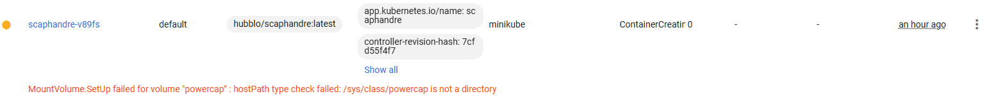
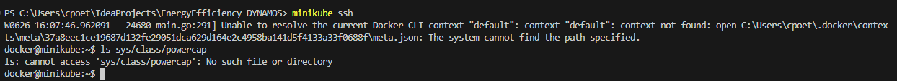
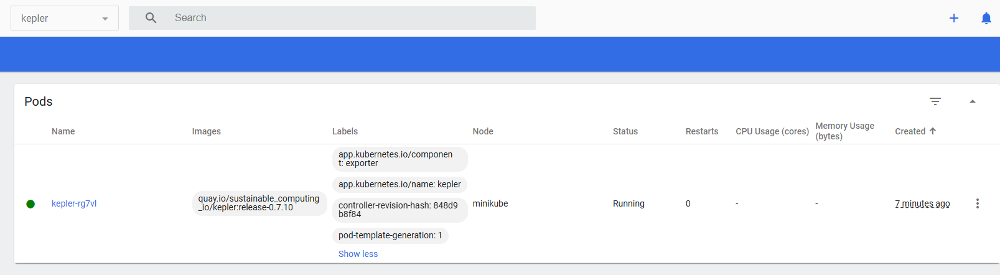
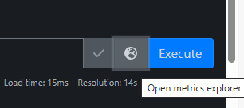
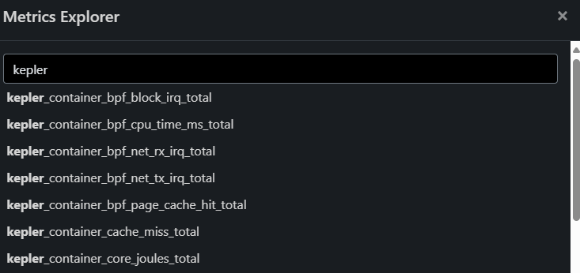

# Energy Consumption Measurements in DYNAMOS

# TODO: if it is not possible for some reason to use Scaphandre, a backup could be Kernel: https://sustainable-computing.io/
Probably NOT possible, since:


This is because powercap is not visible and does not exist:


Therefore, it is unfortunately not possible to use Scaphandre in the current setup. This is probably due to the fact that Scaphandre is only run on physical machines and running Kubernetes using minikube with the Docker engine is creating a Virtual Machine (VM) environment. Therefore, an alternative is considered: Kubernetes Efficient Power Level Exporter (Kepler). This is a Prometheus exporter that is specialized for Kubernetes.
# TODO: add in master thesis when Kernel is working. With above explanation and add short explanation on Kernel using the documentation as a reference!
# TODO: add documentation on how I added energy consumption measurements to DYNAMOS in Prometheus.
# TODO: probably I need to add grafana so that I can persist the metrics from Kernel in Prometheus with Grafana.

## Configure minikube to use cgroup2 driver
See this guide for detailed instructions: https://kubernetes.io/docs/concepts/architecture/cgroups/
The cgroup v2 version is required for metrics to not end up with zeros for Kepler.

1. Delete the old minikube cluster (minikube delete).

2. 
```sh
# Run minikube with:
TODO
```

## Installing Kepler in Kubernetes (minikube used in this example)
```sh
# Kepler setup:
# Install prometheus (already done in step 3_PreparingRabbitMQ of getting started, but to make sure do it again)
helm repo add prometheus-community https://prometheus-community.github.io/helm-charts
helm repo update
helm upgrade -i -f "$corePath/prometheus-values.yaml" monitoring prometheus-community/prometheus
# Install prometheus stack
helm install prometheus prometheus-community/kube-prometheus-stack --namespace monitoring --create-namespace --wait

# Add Kepler
helm repo add kepler https://sustainable-computing-io.github.io/kepler-helm-chart
helm repo update
helm search repo kepler
# Install Kepler
helm install kepler kepler/kepler --namespace kepler --create-namespace --set serviceMonitor.enabled=true --set serviceMonitor.labels.release=prometheus 
# After this final installation you should be able to view the Kepler namespace in minikube dashboard

# Verify ServiceMonitor Configuration
kubectl get servicemonitors -n kepler

# Run the following command to get the services in the monitoring namespace
kubectl get services -n monitoring
# Port-forward to Prometheus, using the above information, Examples:
kubectl port-forward svc/prometheus-kube-prometheus-prometheus -n monitoring 9090:9090
# Or (depending on output of get services): kubectl port-forward svc/prometheus-server -n monitoring 9090:9090
```

It may take a while before Kepler is running, in the first attempt it took 7 minutes:


When Prometheus is running (port forwarded), you can query the kepler metrics by going to the metrics explorer:


Then search for kepler metrics to view the Kepler metrics:


See this guide for detailed information about Kepler metrics: https://sustainable-computing.io/design/metrics/

## Optional: Configuring Grafana
This is only optional. Grafana requires extra steps to setup and is way slower than Prometheus, so this is only if it is ever needed, but not mandatory. Prometheus is more than good enough!
```sh
# Grafana setup
# Install Grafana
helm repo add grafana https://grafana.github.io/helm-charts
helm repo update
helm install grafana grafana/grafana --namespace monitoring --create-namespace
# Get the Grafana password
# Retrieve the base64 encoded password
$encodedPassword = kubectl get secret --namespace monitoring grafana -o jsonpath="{.data.admin-password}"
# Decode the password
$decodedPassword = [System.Text.Encoding]::UTF8.GetString([System.Convert]::FromBase64String($encodedPassword))
# Output the decoded password
$decodedPassword

# Ensure the POD_NAME environment variable is set correctly
$podName = kubectl get pods --namespace monitoring -l "app.kubernetes.io/name=grafana,app.kubernetes.io/instance=grafana" -o jsonpath="{.items[0].metadata.name}"
$env:POD_NAME = $podName
# Output the Pod Name to verify
Write-Output $env:POD_NAME
# Port-forward to Grafana
kubectl --namespace monitoring port-forward pod/$env:POD_NAME 3000:3000
# Then access it via http://localhost:3000/ and login with decoded password and 'admin' as username. This can take a while before login.

# Add Kepler to Grafana dashboard
# Retrieve the Grafana Pod Name
$GF_POD = kubectl get pod -n monitoring -l app.kubernetes.io/name=grafana -o jsonpath="{.items[0].metadata.name}"
# Output the Pod Name to verify
Write-Output $GF_POD
# Download the kepler dashboard.json file example: https://github.com/sustainable-computing-io/kepler/blob/main/grafana-dashboards/Kepler-Exporter-PromRules.json
# Rename it to kepler_dashboard.json. Then add it in the correct place and export the path: C:\Users\cpoet\IdeaProjects\EnergyEfficiency_DYNAMOS\energy-efficiency\kepler_dashboard.json
# Create the /tmp/dashboards directory inside the Grafana pod
kubectl exec -n monitoring $GF_POD -- mkdir -p /tmp/dashboards
# Copy the kepler_dashboard.json file to the specified location in the Grafana pod
# Make sure you are in the correct directory (where kepler_dashboard.json is loacted, e.g. cd .\energy-efficiency\)
kubectl cp kepler_dashboard.json monitoring/$($GF_POD):/tmp/dashboards/kepler_dashboard.json

# Then add the dashboard to the Grafana instance: 
# 1. go to http://localhost:3000/
# 2. Navigate to Dashboards > New > Import
# 3. Import the kepler_dashboard.json file
``` 


<!-- ## Installing scaphandre in Kubernetes cluster
```sh
# Create a new folder/project and open it in VSC.

# Clone the git repository in the new project
git clone https://github.com/hubblo-org/scaphandre

# Go to the scaphandre folder
cd scaphandre

# Install scaphandre in the Kubernetes cluster using helm
helm install scaphandre helm/scaphandre --namespace monitoring
# Or: move the scaphandre folder into the charts folder and then run
helm install scaphandre --namespace monitoring

# Verify installation
helm list
``` 

TODO: prometheus-values.yaml file needs to be configured to add scaphandre?
C:\Users\cpoet\IdeaProjects\EnergyEfficiency_DYNAMOS\charts\core\prometheus-values.yaml
Add this?
```yaml
- job_name: 'scaphandre'
    scrape_interval: 10s
    kubernetes_sd_configs:
    - role: endpoints
      namespaces:
        names:
        - monitoring
    relabel_configs:
    - source_labels: [__meta_kubernetes_service_label_app]
      action: keep
      regex: scaphandre
```
-->