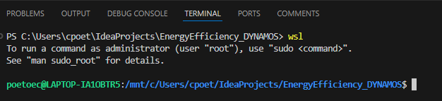

# Improved guide on how to use WSL on Windows

Follow this guide: https://learn.microsoft.com/en-us/windows/wsl/install

After installation using the command:
```sh
wsl --install
```
This command installs the latest WSL version and sets WSL 2 as the default.

It will then ask you to create a new default UNIX user account. Make sure to create an easy to remember username and password. It is not the best password security wise, but it is just for local development, so create something like this for example:
```
Enter new UNIX username: poetoec
New password: poetoec
```

Now WSL is installed and you can use Linux on your Windows machine! For example, you can open wsl in VSC by opening a powershell terminal and running:
```sh
wsl
```

In this example it opens the project that I have located on my Windows file system in wsl:


It opens it in: poetoec@LAPTOP-IA1OBTR5:/mnt/c/Users/cpoet/IdeaProjects/EnergyEfficiency_DYNAMOS$ 
The /mnt is used to mount the Windows file system into the WSL environment. Each drive in Windows is mounted under /mnt, allowing you to access your Windows files from within the Linux environment. So, when you access a project in VSC and then in the terminal open wsl, it will automatically open this project for you. 

## Using root privelleges 
To use root privelleges add the following before the commands: sudo, such as
```sh
sudo <original command>
```

## Packages and apps in WSL
In the wsl environment you run the project from a Linux environment, such as using Python or Java, etc. However, the packages/apps that you installed on Windows are not all available in WSL (Linux). So, you need to manage your own packages here. For Ubuntu (which is the default in WSL) you can do that with this command (running in WSL of course, see above how to access wsl in the terminal):
```sh
sudo apt update && sudo apt upgrade
```
It is recommended to run this command once in a while to update all packages.

## Exit and restart wsl
```sh
# Exit wsl session (from inside wsl session in VSC powershell for example)
exit

# Restart wsl
wsl --shutdown
```

## Copy and paste in WSL (Linux environment)
In 2024 it was possible to use ctrl+c/ctrl+v to copy and paste when opening the terminal in wsl. However, in some Linux environments it is not possible and you need to do this manually with the right mouse click and then select copy/paste. Test this out to see what works and what does not in your specific environments. In some environments it automatically pastes the copied content for you when using the right mouse click (e.g. in a terminal).
In some cases it even works to use ctrl+arrow to quickly navigate through the terminal lines for example!