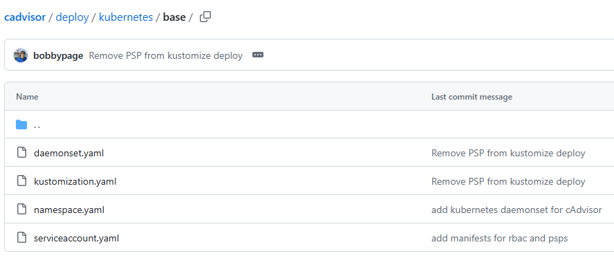

# cadvisor metrics not including label for container name
This issue was occurring because I had not deployed cadvisor as a separate daemonset in my Kubernetes cluster. Therefore, it did not display the metrics correctly, even though Kubelet contains cadvisor. So, you need to deploy cadvisor as a separate daemonset to allow it to gather metrics on all nodes/pods/containers, etc.

Firstly, add cavisor as a daemonset (this includes the namespace and serviceaccount), such as:
```yaml
# cadvisor (namespace, serviceaccount and daemonset)
apiVersion: v1
kind: Namespace
metadata:
  name: cadvisor
---

apiVersion: v1
kind: ServiceAccount
metadata:
  name: cadvisor
  namespace: cadvisor
---

apiVersion: apps/v1
kind: DaemonSet
metadata:
  name: cadvisor
  namespace: cadvisor
  labels:
    name: cadvisor
spec:
  selector:
    matchLabels:
      name: cadvisor
  template:
    metadata:
      labels:
        name: cadvisor
    spec:
      serviceAccountName: cadvisor
      containers:
      - name: cadvisor
        image: {{ .Values.cadvisor.image.repository }}:{{ .Values.cadvisor.image.tag }}
        resources:
          requests:
            memory: {{ .Values.cadvisor.resources.requests.memory }}
            cpu: {{ .Values.cadvisor.resources.requests.cpu }}
          limits:
            memory: {{ .Values.cadvisor.resources.limits.memory }}
            cpu: {{ .Values.cadvisor.resources.limits.cpu }}
        args:
        # Housekeeping is the interval that cadvisor gathers metrics (Default is 1s, increase to reduce resource usage)
        - --housekeeping_interval=60s
        - --max_housekeeping_interval=60s
        # Disable not needed metrics (saves resources) 
        # If metrics are missing, see this link and remove the disable option here: https://github.com/google/cadvisor/blob/master/docs/storage/prometheus.md
        - --disable_metrics=advtcp,cpuLoad,cpu_topology,cpuset,hugetlb,memory_numa,network,oom_event,percpu,perf_event,process,referenced_memory,resctrl,sched,tcp,udp
        volumeMounts:
        - name: rootfs
          mountPath: /rootfs
          readOnly: true
        - name: var-run
          mountPath: /var/run
          readOnly: true
        - name: sys
          mountPath: /sys
          readOnly: true
        - name: docker
          mountPath: /var/lib/docker
          readOnly: true
        - name: disk
          mountPath: /dev/disk
          readOnly: true
        ports:
          - name: http
            containerPort: {{ .Values.cadvisor.service.port }}
            protocol: TCP
      automountServiceAccountToken: false
      terminationGracePeriodSeconds: 30
      volumes:
      - name: rootfs
        hostPath:
          path: /
      - name: var-run
        hostPath:
          path: /var/run
      - name: sys
        hostPath:
          path: /sys
      - name: docker
        hostPath:
          path: /var/lib/docker
      - name: disk
        hostPath:
          path: /dev/disk
```
Make sure that you deploy it as a helm chart, such as in the monitoring helm chart located in this project.

This is the .yaml file containing namespace.yaml, serviceaccount.yaml and daemonset.yaml from https://github.com/google/cadvisor/tree/master/deploy/kubernetes/base all in one, with the image changed to a newer one and including variables set in a helm chart:


Then prometheus needs to be configured appropriately to scrape the metrics from cadvisor:
```sh
# Set variables for the paths (example with the monitoring chart path)
monitoringChartsPath="/mnt/c/Users/cpoet/IdeaProjects/EnergyEfficiency_DYNAMOS/charts/monitoring"
monitoringValues="$monitoringChartsPath/values.yaml"

# Add the job to the prometheus config file:
# Keep this format for this part, because this works for adding additional scrape configs!
prometheus:
  prometheusSpec:
    # Set global scrape interval and scrape timeout
    # Set this to higher to avoid cadvisor sometimes timing out
    scrapeInterval: "30s"
    scrapeTimeout: "25s"
    evaluationInterval: "1m"

    # Additional scrape configs (on top of already present/default ones)
    additionalScrapeConfigs:
      # Job to gather metrics like CPU and memory using cadvisor daemonset
      - job_name: 'cadvisor'
        # Configures Kubernetes service discovery to find pods
        kubernetes_sd_configs:
          - role: pod
        # Configures relabeling rules
        relabel_configs:
          # Keep only pods with the label app=cadvisor (otherwise all other metrics will be included, but you only want cadvisor metrics)
          # Make sure that the name label is present in the pod (or in this case daemonset) you are creating! Otherwise, Prometheus cannot see it
          - source_labels: [__meta_kubernetes_pod_label_name]
            action: keep
            regex: cadvisor
          # Replace target with pod IP and port 8080 (where cadvisor runs)
          - source_labels: [__meta_kubernetes_pod_ip]
            action: replace
            target_label: __address__
            regex: (.+)
            replacement: ${1}:8080
          # No custom labels/replacements are set here (do NOT change this, because now it works!), so that the defaults of 
          # cadvisor are used! For example, you can group by name of the container with: container_label_io_kubernetes_container_name
# Disable grafana from prometheus stack (not needed anyway)
grafana:
  enabled: false


# Rerun/upgrade Prometheus stack with the file
helm upgrade -i prometheus prometheus-community/kube-prometheus-stack --namespace monitoring -f "$monitoringChartsPath/prometheus-config.yaml"

# Upgrade/apply the helm chart for the monitoring release:
helm upgrade -i -f "$monitoringValues" monitoring $monitoringChartsPath

# Then delete the prometheus operator pod (recreates it automatically == restart pod)
kubectl delete pod prometheus-kube-prometheus-operator-<stringInPodName> -n monitoring
# e.g.: kubectl delete pod prometheus-kube-prometheus-operator-6554f4464f-x2dw9 -n monitoring

# Then port forward promtheus and see if it is working
kubectl port-forward svc/prometheus-kube-prometheus-prometheus -n monitoring 9090:9090
```
Go to the Prometheus UI and navigate to Status > Targets. Here you should see that cadvisor is in the targets:


At first it will say down/unhealthy, because it is still initializing. (Except if there are errors shown). In a minute (you could try refreshing the page to see it faster) it should say up and when it says you can see something like this:


Then you can see that the target is up and new metrics have been collected. Then you can go to /graph in the Prometheus UI to view the changes:

```sh
# There are different metrics available now for this metric example, such as this format:
container_cpu_system_seconds_total{id="/", instance="10.244.0.80:8080", job="cadvisor"}

# Or this format:
container_cpu_system_seconds_total{id="/kubepods.slice/kubepods-besteffort.slice/kubepods-besteffort-pod08645525_d2f6_45db_a76a_ef770b179f8d.slice", instance="10.244.0.80:8080", job="cadvisor"}

# Or this format
container_cpu_system_seconds_total{container_label_annotation_kubernetes_io_config_seen="2024-07-02T05:26:47.297169660Z", container_label_annotation_kubernetes_io_config_source="api", container_label_app="grafana", container_label_io_kubernetes_container_name="POD", container_label_io_kubernetes_docker_type="podsandbox", container_label_io_kubernetes_pod_name="grafana-864bdb476c-qklw6", container_label_io_kubernetes_pod_namespace="core", container_label_io_kubernetes_pod_uid="0b973a09-283f-4fd7-a890-e3cfdef48af4", container_label_pod_template_hash="864bdb476c", id="/kubepods.slice/kubepods-besteffort.slice/kubepods-besteffort-pod0b973a09_283f_4fd7_a890_e3cfdef48af4.slice/docker-f4cbc2b4601ad7f825435098358f5aefa18abdb9332098400da0973893a3b8f2.scope", image="registry.k8s.io/pause:3.9", instance="10.244.0.80:8080", job="cadvisor", name="k8s_POD_grafana-864bdb476c-qklw6_core_0b973a09-283f-4fd7-a890-e3cfdef48af4_2"}

# This is the format you are looking for, as it contains the name of the container (container_label_io_kubernetes_container_name="linkerd-proxy"):
container_cpu_system_seconds_total{container_label_annotation_io_kubernetes_container_hash="3a050d51", container_label_annotation_io_kubernetes_container_ports="[{"name":"linkerd-proxy","containerPort":4143,"protocol":"TCP"},{"name":"linkerd-admin","containerPort":4191,"protocol":"TCP"}]", container_label_annotation_io_kubernetes_container_restartCount="2", container_label_annotation_io_kubernetes_container_terminationMessagePath="/dev/termination-log", container_label_annotation_io_kubernetes_container_terminationMessagePolicy="FallbackToLogsOnError", container_label_annotation_io_kubernetes_pod_terminationGracePeriod="30", container_label_io_kubernetes_container_logpath="/var/log/pods/linkerd_linkerd-proxy-injector-67945967d6-r9vg7_3560a86c-7de3-448d-b452-68d50f15e607/linkerd-proxy/2.log", container_label_io_kubernetes_container_name="linkerd-proxy", container_label_io_kubernetes_docker_type="container", container_label_io_kubernetes_pod_name="linkerd-proxy-injector-67945967d6-r9vg7", container_label_io_kubernetes_pod_namespace="linkerd", container_label_io_kubernetes_pod_uid="3560a86c-7de3-448d-b452-68d50f15e607", container_label_io_kubernetes_sandbox_id="37e308d755f551e5ac00565d3daf4d7fb58c67993d3913b7bbe293e426cccea3", id="/kubepods.slice/kubepods-besteffort.slice/kubepods-besteffort-pod3560a86c_7de3_448d_b452_68d50f15e607.slice/docker-877f95410fc8ff758ceb4525bf4b4d6452804e2539d3b48d77ec5721019a3469.scope", image="sha256:c50fbb2aec4d19e6b5b03e7d13da23145f8c50e1f333199f5a2a446d8e37bcf7", instance="10.244.0.80:8080", job="cadvisor", name="k8s_linkerd-proxy_linkerd-proxy-injector-67945967d6-r9vg7_linkerd_3560a86c-7de3-448d-b452-68d50f15e607_2"}
```
The final example shows the linkerd-proxy name as the name of the container (container_label_io_kubernetes_container_name="linkerd-proxy"). This is the name you want to see, because as you can see in the image below:


The 'linkerd-proxy-injector-67945967d6-r9vg7' pod contains the container with name 'linkerd-proxy'. This can be seen by the following information in the last output:
container_label_io_kubernetes_pod_name="linkerd-proxy-injector-67945967d6-r9vg7"

This is also what it should be for grouping the results by name, then you can filter by containers for example:


In this case you can see that we filter by 'container_label_io_kubernetes_container_name', which is equal to the container name that is provided by cadvisor in the used version. This is how you can filter these results by container.