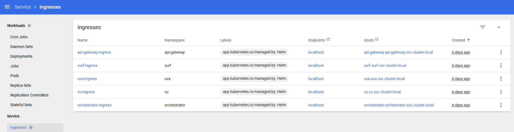

# Installing and Configuring DYNAMOS (follow installation guide)
Follow the installation guide for DYNAMOS. Below is extra explanation that may be helpful.

## Setup Linkerd
After installing the prerequisites, install Linkerd:
https://github.com/Jorrit05/DYNAMOS?tab=readme-ov-file#6-linkerd
This only includes these after installing:
```sh
# Install Linkerd on cluster
linkerd install --crds | kubectl apply -f -
linkerd install --set proxyInit.runAsRoot=true | kubectl apply -f -

linkerd check
# This may take some time before everything is setup, wait until the check finishes

# Install Jaeger onto the cluster for observability
linkerd jaeger install | kubectl apply -f -

# Optionally install for insight dashboard - not currently in use
# linkerd wiz install | kubectl apply -f -
```

## Configure DYNAMOS system
Then configure the system: https://github.com/Jorrit05/DYNAMOS?tab=readme-ov-file#system-configuration 
In short, this encompasses setting the correct paths and running the start script from the root of DYNAMOS:
```sh
./configuration/dynamos-configuration.sh

# Possible problems:

# When getting this error: Error: INSTALLATION FAILED: cannot re-use a name that is still in use
# This is because you already installed nginx and are using the install instead of upgrade, as you can see by the previous lines: Installing NGINX...
# Fix this by uninstalling the release nginx:
helm uninstall nginx -n ingress
# Then run the command again:
./configuration/dynamos-configuration.sh

# "running scripts is disabled on this system" error:
# 1. Close VSC/ 2. Run VSC as administrator / 3. Open powershell terminal (outside wsl) / 4. Run:
Set-ExecutionPolicy RemoteSigned
# 5. Close VSC / 6. Open VSC how you normally do and rerun the script

# If you get something like: -bash: ./prometheus.sh: /bin/bash^M: bad interpreter: No such file or directory
# this is because the file contains Windows-style line endings (CRLF) instead of the Unix-style line endings (LF) expected in WSL or Linux environments.
# Fix this by running the following 
dos2unix ./configuration/dynamos-configuration.sh
# Then execute the script again
```


## Expose DYNAMOS with etc (edit host file), only needs to be done once on your computer
To expose DYNAMOS and be able to send requests using Postman or curl for example, edit the configuration file:
```sh
# Install etcd on WSL (not sure if this step is necessary, may be possible without installing etcd)
brew install etcd

# Update the hostfile:
sudo vim /etc/hosts
# To exit type :qa or :qa! and press Enter
# This could say something like:
# This file was automatically generated by WSL. To stop automatic generation of this file, add the following entry to /etc/wsl.conf:
# [network]
# generateHosts = false

# Follow this to disable WSL automatically generating the file:
sudo nano /etc/wsl.conf
# End this to the end of the file:
[network]
generateHosts = false
# Save and exit: Ctrl+O, Enter, then Ctrl+X
# Open the file and check if it is now present:
sudo nano /etc/wsl.conf
# Exit: Ctrl+X
# Exit wsl terminal
exit
# Restart WSL instance to apply changes 
# (this leads to Docker Desktop having to restart, select Restart in Docker Desktop when prompted)
wsl --shutdown
# Open wsl terminal again
wsl

# Now try again and press i after running that command to enter instert mode:
sudo vim /etc/hosts
# You will still see something like this, because it added it in the first auto generation:
# This file was automatically generated by WSL. To stop automatic generation of this file, add the following entry to /etc/wsl.conf:
# [network]
# generateHosts = false

# Then add this to the end of the file (including comment):
# Expose DYNAMOS
127.0.0.1 api-gateway.api-gateway.svc.cluster.local
# (you can paste by right-clicking with the mouse)
# Then press Esc to exit insert mode
# Save changes by typing :w
# Exit by typing :q

# Then when you open it again it should have the added line:
sudo vim /etc/hosts

# Test the connection like this:
ping api-gateway.api-gateway.svc.cluster.local
# Should return something similar to:
Pinging api-gateway.api-gateway.svc.cluster.local [127.0.0.1] with 32 bytes of data:
Reply from 127.0.0.1: bytes=32 time<1ms TTL=128
# Press Ctrl+C to exit
```

To also enable Postman to work, you need to edit the host file in Windows as well:
```sh
# Open Notepad with admin rights (admin rights are important because you edit Windows files):
# Search Notepad > Right-click > Run as administrator

# In the Notepad opened, select File > Open and add in the search bar C:\Windows
# Then Select Systemx, in 2025 this was System32 and open drivers and etc, such as:
# C:\Windows\System32\drivers\etc

# Then select All files in the bottom right to show all files

# Then open the hosts file *name is "hosts", and File Type is "File") and add this to the end of the line (including comment):
# Expose DYNAMOS:
127.0.0.1 api-gateway.api-gateway.svc.cluster.local
# Save the changes

# Then flush the DNS in a cmd (no admin rights necessary). This is harmless and can be freely used, only clears the DNS resolver cache
# Flush dns with this command in the cmd:
ipconfig /flushdns
# Then possibly you have to restart cmd and other applications if it is not working yet

# Test the connection like this in a cmd:
ping api-gateway.api-gateway.svc.cluster.local
# Should return something similar to:
Pinging api-gateway.api-gateway.svc.cluster.local [127.0.0.1] with 32 bytes of data:
Reply from 127.0.0.1: bytes=32 time<1ms TTL=128
# Press Ctrl+C to exit

# Now you should be able to use Postman to send requests
```

### Adding additional hosts (required for developing in DYNAMOS), only needs to be done once on your computer
Firstly, to understand the endpoints available, you can go to Service > Ingresses (with all namespaces selected) in the Kubernetes Dashboard to view all ingresses available, showing all the possible hosts:



You can click on one to view the details.

Now that you understand the ingresses and viewed which ones are available, follow these steps:
```sh
# First follow the same steps above  to update the host files in WSL by adding at the bottom of the file:
# (these are the hosts from the ingresses and the first part with the numbers is localhost)
127.0.0.1 surf.surf.svc.cluster.local
127.0.0.1 uva.uva.svc.cluster.local
127.0.0.1 vu.vu.svc.cluster.local
127.0.0.1 orchestrator.orchestrator.svc.cluster.local
# Then test the connection again in a similar way like described earlier

# Then do the same for the Windows steps like explained earlier and test the connection again (see steps above)
```


## Add DYNAMOS configs for helper functions
Now you can load the DYNAMOS configs shell file with some env vars and helper functions. You can add this code directly in your WSL ~/.bashrc file to not have to manually load it each time in the shell, however, for this setup we chose to not do this, since this configuration changes between different use cases (e.g. UNL and Prets) and therefore is easier to load manually each time in this case.
To load the configuration file run the following:
```sh
# Go to the scripts path
cd energy-efficiency/scripts
# Make the script executable (needs to be done once)
chmod +x dynamos-configs.sh
# Load the script in the terminal
source ./dynamos-configs.sh

# Now you can run functions, such as:
deploy_core
# You need to load the file in the shell each time you restart a shell or when making changing to the dynamos-configs.sh script
```
You can change this file whenever you want, such as adding or removing helpful functions. After changes you have to load it in the shell again each time. Also, for each terminal you have to load the file, so it is recommended to use one terminal to execute those functions when developing. 


Now test DYNAMOS, such as using curl:
```sh
# In a WSL terminal run curl with the specified command in the DYNAMOS main README.md or use the Postman request.
# Example:
curl --location 'http://api-gateway.api-gateway.svc.cluster.local:80/api/v1/requestApproval' \
--header 'Content-Type: application/json' \
--data-raw '{
    "type": "sqlDataRequest",
    "user": {
        "id": "12324",
        "userName": "jorrit.stutterheim@cloudnation.nl"
    },
    "dataProviders": ["VU","UVA","RUG"]
}'
# This will eventually return something like this after the request:
{
    "authorized_providers": {
        "UVA": "uva.uva.svc.cluster.local",
        "VU": "vu.vu.svc.cluster.local"
    },
    "jobId": "jorrit-stutterheim-c7bd19b2"
}
```

Now DYNAMOS is running and you can set up monitoring.