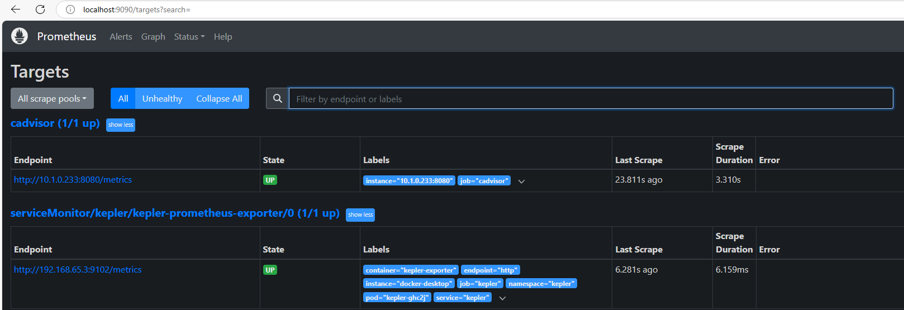

# Setup Monitoring
This guide provides explanation on how to setup monitoring in the Kubernetes environment, including energy monitoring.

## Setup Kubernetes Dashboard
Kubernetes Dashboard can be used to monitor and manage the Kubernetes environment. To setup Kubernetes Dashboard, run the following:
```sh
# Go to the scripts path
cd energy-efficiency/scripts
# Make the script executable (needs to be done once)
chmod +x kubernetes-dashboard.sh
# Execute the script:
./kubernetes-dashboard.sh
```
Then you can access Kubernetes Dashboard and get the token from the admin user in the kubernetes-dashboard namespace like this:
```sh
# Access Kubernetes Dashboard
kubectl -n kubernetes-dashboard port-forward svc/kubernetes-dashboard-kong-proxy 8443:443
# Access it at: https://localhost:8443/
# If it says something like net::ERR_CERT_AUTHORITY_INVALID, Your connection isn't private, you can select 
# Advanced > Continue to localhost (unsafe). You can do this because you know it is Kubernetes and this is save to use

# Get the token from the admin user that can be used to login in the Kubernetes Dashboard cluster
kubectl get secret admin-user -n kubernetes-dashboard -o jsonpath={".data.token"} | base64 -d
# Add the token in the login window and you should be able to access Kubernetes Dashboard
```

## Setup Energy Monitoring
Used this guides as leading installations: 
- https://github.com/prometheus-community/helm-charts/tree/main/charts/kube-prometheus-stack
- https://sustainable-computing.io/installation/kepler-helm/

Below is extra explanation on how to do this precisely.

# Setup Prometheus Stack (includes Grafana)
Run the following:
```sh
# Go to the scripts path (in WSL like with all other scripts)
cd energy-efficiency/scripts/prepare-monitoring
# Make the script executable (needs to be done once)
chmod +x prometheusAndGrafana.sh

# Execute the script:
./prometheusAndGrafana.sh
```
This might take a while, since it is installing a lot of different things, such as prometheus-stack.

Wait for the resources above to be created. The final message of the file will be for example:
```
Release "prometheus" has been upgraded. Happy Helming!
NAME: prometheus
LAST DEPLOYED: Tue Jul  2 13:29:32 2024
NAMESPACE: monitoring
STATUS: deployed
REVISION: 2
TEST SUITE: None
NOTES:
kube-prometheus-stack has been installed. Check its status by running:
  kubectl --namespace monitoring get pods -l "release=prometheus"
```

You can see that you can use the command to view the status:
```sh
# View status of prometheus release
kubectl --namespace monitoring get pods -l "release=prometheus"

# Example output:
NAME                                                   READY   STATUS              RESTARTS   AGE
prometheus-kube-prometheus-operator-6554f4464f-tf9k8   0/1     ContainerCreating   0          97s
prometheus-kube-state-metrics-558db85bb5-f64sh         0/1     ContainerCreating   0          97s
prometheus-prometheus-node-exporter-82mwd              0/1     ContainerCreating   0          97s
# With this example output you know that you should wait, because it is still creating the containers
```
Alternatively, you could use Kubernetes dashboard and view the monitoring namespace and wait until the pods are running. It may take a while before all the pods are running, sometimes even up to more than 10 minutes. 


## Preparing Kepler (energy measurements)
After the pods are running, you can execute the next script:
```sh
# Go to the scripts path
cd cd energy-efficiency/scripts/prepare-monitoring
# Make the script executable (needs to be done once)
chmod +x keplerAndMonitoringChart.sh

# Execute the script:
./keplerAndMonitoringChart.sh
```

Then add Kepler Dashboard to Grafana and verify Grafana installation:
```sh
# Set a variable in WSL terminal for the Grafana POD
GF_POD=$(
    kubectl get pod \
        -n monitoring \
        -l app.kubernetes.io/name=grafana \
        -o jsonpath="{.items[0].metadata.name}"
)
# Verify the variable
echo $GF_POD

# Download the kepler_dashboard.json file: https://github.com/sustainable-computing-io/kepler/blob/main/grafana-dashboards/Kepler-Exporter.json
# Add it to your project (e.g. in VSC) so you can easily add it from WSL terminal.
# Rename it to kepler_dashboard.json.
# cd to the path where the kepler_dashboard.json file is located in the WSL terminal and run:
kubectl cp kepler_dashboard.json monitoring/$GF_POD:/tmp/dashboards/kepler_dashboard.json

# Port-forward Grafana in another WSL terminal
kubectl port-forward -n monitoring service/prometheus-grafana 3000:80
# Access it at http://localhost:3000/
# Login with username admin
# Get the password:
kubectl get secret -n monitoring prometheus-grafana -o jsonpath="{.data.admin-password}" | base64 --decode ; echo
```
Now you should be able see the dashboard in Grafana if you go to Dashboards > search for Kepler, such as Kepler Exporter Dashboard.


Finally, you can verify Kepler and cAdvisor running by port-forwarding Prometheus:
```sh
# Port-forward Prometheus stack
kubectl port-forward svc/prometheus-kube-prometheus-prometheus -n monitoring 9090:9090
# Access it at http://localhost:9090/
```

Check the Prometheus Targets at the Prometheus instance > Status > Targets, you should see at least cAdvisor and Kepler with up status, some targets might not be up, but that is probably fine, as long as those two are up, you are good to go:


Then you can execute a query in Prometheus to see energy metrics from Kepler to verify Kepler is running:
```sh
sum(kepler_container_joules_total) by (pod_name, container_name, container_namespace, node)
```
You should now see energy metrics per container. A lof of these values will be 0, but that is correct, since these do not use energy at the moment or Kepler could not measure them. However, as long as you can see some containers with data values, specifically the ones you want to measure, that is good.

See this guide for detailed information about Kepler metrics: https://sustainable-computing.io/design/metrics/

Now you are all set to monitor and measure energy consumption!